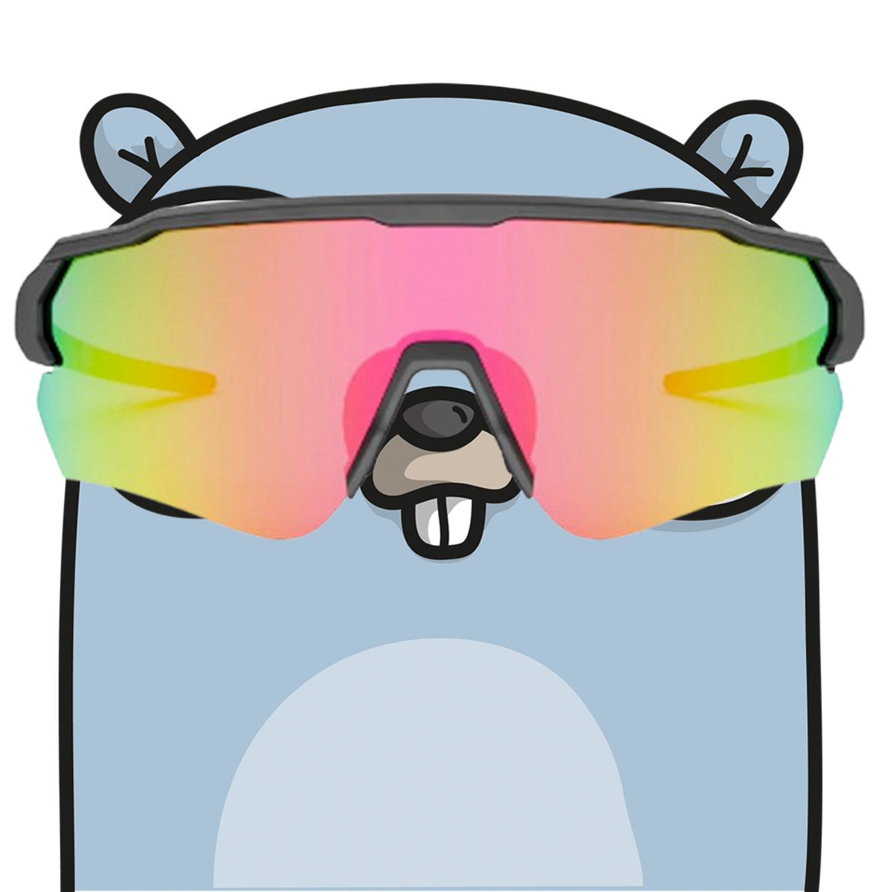

# Go-train



this project aims to control my indoor bike trainer with a training and display the training as it would on Zwift or other platforms. Since I don't care about those virtual environments, but I'd like to watch a movie, the training should be shown as an overlay.

## Goal

The ultimate goal of this app is to start a predefined training, finish it on my bike trainer at home and upload it to Strava.

## Running the project

This is a `go 1.23.0` project

```bash
# After cloning
1. go mod tidy

# Looks for a suitable bluetooth trainer, starts a training and controls the trainer.
2a. go run main.go 

# Starts a training on a mock bluetooth trainer. It mocks incoming data from the trainer
2b. go run main.go -m true
```
